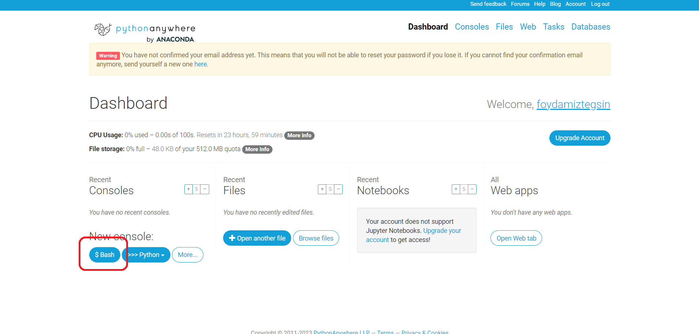
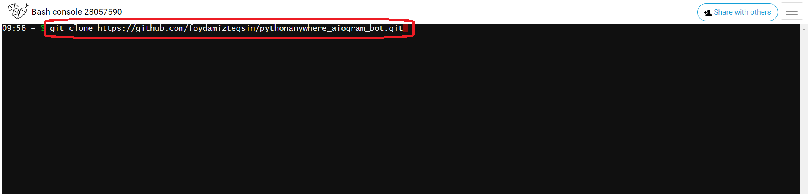
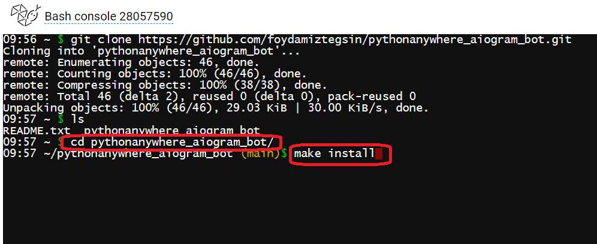
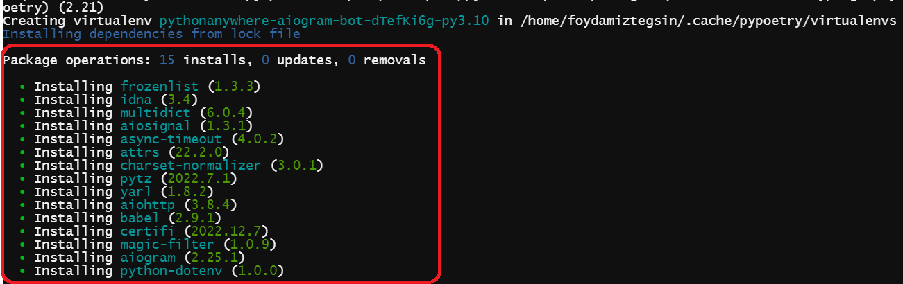
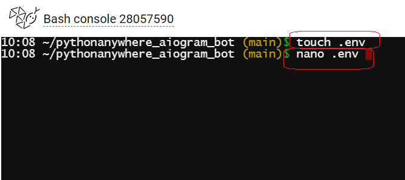
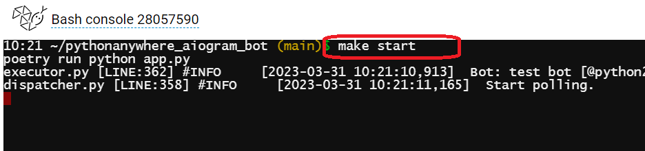

# aiogram-bot-shablon
Telegramda  aiogram  orqali  bot tuzish uchun shablon

 
 

Fikr va  mulohazalar uchun [Dasturlash bo'yicha Foydamiz Tegsin!](https://t.me/foydamizteg_sin)

# Loyihani  yuklash

> *$Bash*
 

> *Loyihani clon qiling*
 

> *Loyihani papkasiga kiring va __make install__*
 

> *Rasmdagi  holat kuzatilishiga e'tibor bering*
 

> *Shu yerda(loyiha papkasini ichida) .env fayl yarating va faylga yozish uchun nano .env buyrug'ini bering*
 

- .env fayl yarating va faylga env.exam faylida ko'rsatilganlarni yozing....
 
- PROXY_URL ga http://proxy.server:3128 ni yozing
 
- BOT_TOKEN ni [BotFather](https://t.me/BotFather) dan olishingiz mumkin!
 
- ADMINS uchun ID lar   [Get My ID](https://t.me/getmyid_bot) shu yerga yozing ID - ingizni bilishingiz mumkin
 

> *Loyihani ishga tushiring __make start__*
 

- Mehnatimiz sizga foyda berayotgan bolsa GITHUB profilimizga obuna bo'ling va telegram kanalimizda reaksiyalarni qoldiring 👍
# *E'tiboringiz uchun rahmat* Savollaringiz bo'lsa [Telegram](https://t.me/foydamizteg_sin)
